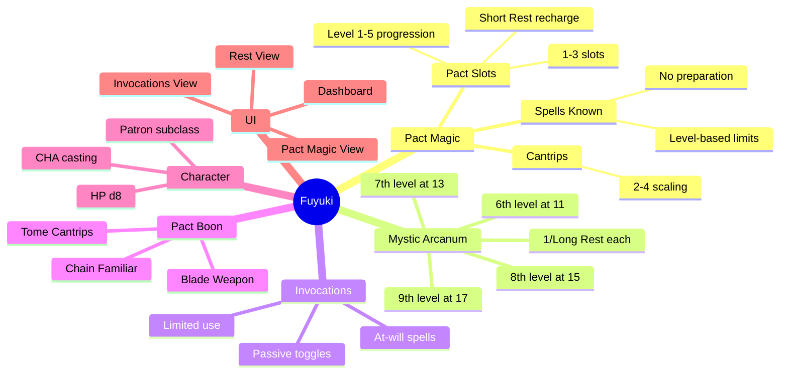
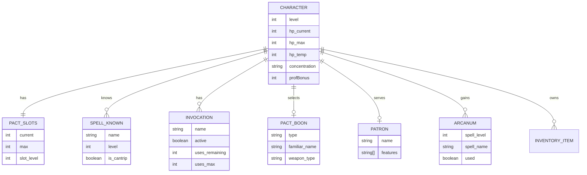
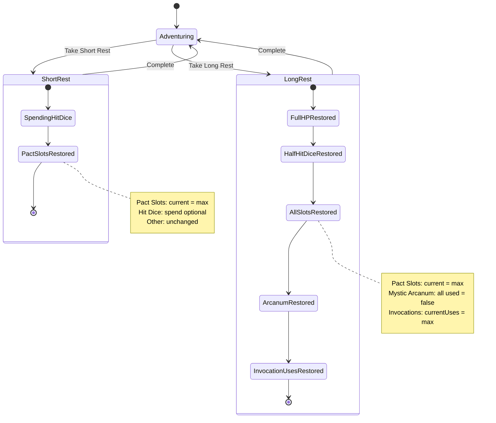
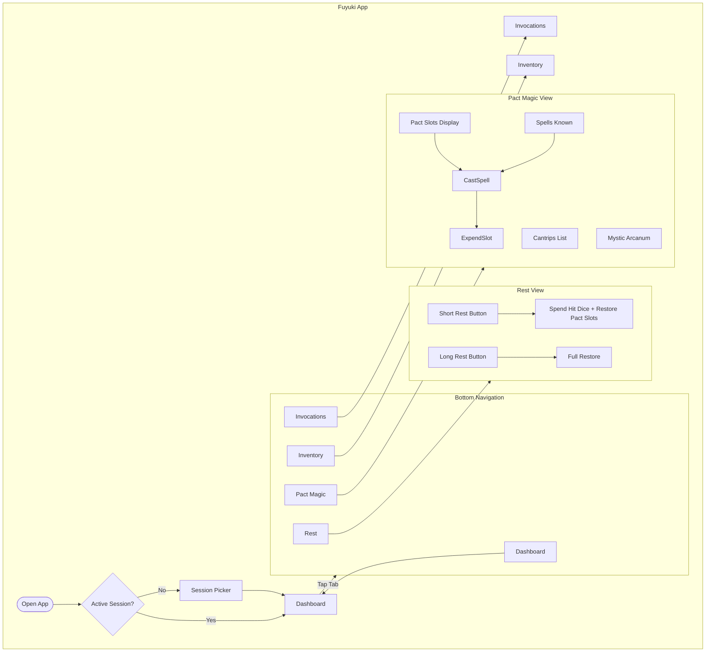
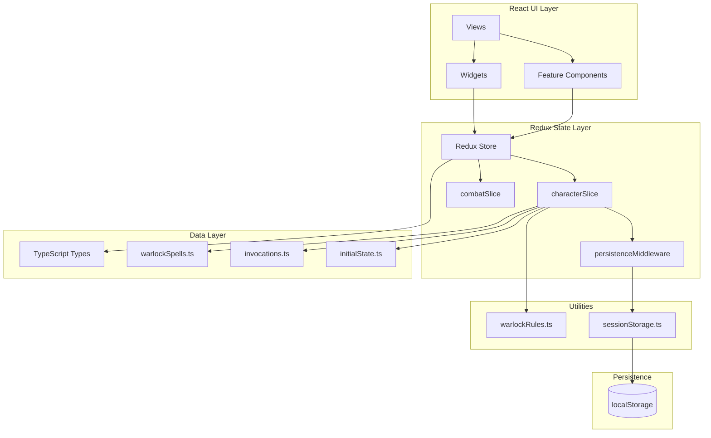
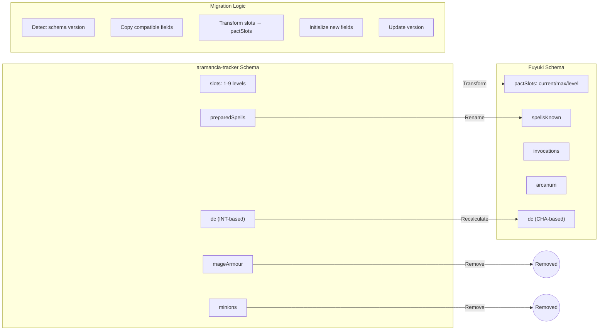

# Fuyuki - D&D 5e Warlock Tracker

> A fork of aramancia-tracker, replacing Wizard logic with Warlock mechanics. Japanese-inspired minimalist design.

**Deadline**: Sunday, 18 Jan 2026 (Australia/Brisbane time)  
**Today**: Thursday, 15 Jan 2026  
**Available Days**: 3.5 days

---

## A) Repository Audit: aramancia-tracker

### Summary
aramancia-tracker is a D&D 5e **Wizard** character tracker PWA with offline support. It tracks HP, AC, spell slots (1-9 full caster progression), concentration, death saves, minions (undead), and inventory with item charges.

### Major Screens
| Screen | File | Purpose |
|--------|------|---------|
| Dashboard/Stats | `src/components/views/StatsView.tsx` | Ability scores, skills, concentration status, spell slots summary |
| Character | `src/components/views/CharacterView.tsx` | Level, HP editor, AC display |
| Combat | `src/components/views/CombatView.tsx` | Spellcasting state machine, minion actions |
| Grimoire | `src/components/views/GrimoireView.tsx` | Prepared spells list, SRD spell reference |
| Inventory | `src/components/views/InventoryView.tsx` | Items, attunement, charges |
| Rest | `src/components/views/RestView.tsx` | Short/Long rest with hit dice spending |
| Biography | `src/components/views/BiographyView.tsx` | Character lore/backstory |

### State Management
- **Redux Toolkit** with 3 slices:
  - `characterSlice.ts` - All character data (HP, slots, abilities, etc.)
  - `combatSlice.ts` - Combat state machine, concentration, minions (EntityAdapter)
  - `spellbookSlice.ts` - Spell expenditure cross-slice actions
- **persistenceMiddleware.ts** - Auto-saves to localStorage on character actions

### Persistence
- **localStorage** via `src/utils/sessionStorage.ts`
- Schema versioning (`SCHEMA_VERSION = '2.0'`)
- Session-based saves with migration logic
- Keys: `aramancia-sessions`, `aramancia-active-session`

### Testing Approach
- **Vitest** for unit/component tests
- Tests in `src/test/`:
  - `srdRules.test.ts` - Proficiency, ability mods, spell slots, HP calc
  - `HealthWidget.test.tsx`, `SpellSlotsWidget.test.tsx`, etc.
- **Preflight script**: `./preflight.sh` (tsc → lint → test → build)

### Stack
| Tool | Version | Purpose |
|------|---------|---------|
| React | 19.2 | UI Framework |
| Vite | 7.2 | Build tool |
| Redux Toolkit | 2.11 | State management |
| Tailwind CSS | 4.1 | Styling |
| Vitest | 4.0 | Testing |
| Capacitor | 8.0 | Mobile (Android) |
| Firebase Hosting | - | Deployment |
| Lucide React | 0.555 | Icons |
| Zod | 3.24 | Schema validation |

---

### Module Classification

| Component/Module | Purpose | Action | File Path(s) |
|-----------------|---------|--------|--------------|
| characterSlice | Core character state | **MODIFY** (CHA casting, pact slots) | `src/store/slices/characterSlice.ts` |
| combatSlice | Combat state machine | **KEEP** (nearly identical) | `src/store/slices/combatSlice.ts` |
| spellbookSlice | Slot expenditure | **MODIFY** (pact slot usage) | `src/store/slices/spellbookSlice.ts` |
| persistenceMiddleware | Auto-save | **KEEP** | `src/store/slices/persistenceMiddleware.ts` |
| srdRules.ts | D&D calculations | **MODIFY** (warlock slots, CHA DC) | `src/utils/srdRules.ts` |
| sessionStorage.ts | Session persistence | **MODIFY** (new schema keys) | `src/utils/sessionStorage.ts` |
| HealthWidget | HP tracking | **KEEP** | `src/components/widgets/HealthWidget.tsx` |
| SpellSlotsWidget | Slot display | **REPLACE** (PactSlotsWidget) | `src/components/widgets/SpellSlotsWidget.tsx` |
| ConcentrationWidget | Concentration | **KEEP** | `src/components/widgets/ConcentrationWidget.tsx` |
| HitDiceWidget | Hit dice spending | **KEEP** (change d6→d8) | `src/components/widgets/HitDiceWidget.tsx` |
| MinionDrawer | Undead minions | **REMOVE** (not warlock-relevant) | `src/components/minions/` |
| WildShapeWidget | Druid feature | **REMOVE** | `src/components/widgets/WildShapeWidget.tsx` |
| spells.ts | Wizard spell data | **REPLACE** (warlock spells) | `src/data/spells.ts` |
| initialState.ts | Default character | **REPLACE** (warlock defaults) | `src/data/initialState.ts` |
| RestView | Short/Long rest | **MODIFY** (pact slots on short rest) | `src/components/views/RestView.tsx` |
| GrimoireView | Spellbook | **MODIFY** → InvocationsView | `src/components/views/GrimoireView.tsx` |
| index.css | Global styles | **MODIFY** (Kyoto palette) | `src/index.css` |

---

## B) Warlock Domain Model (SRD 5.1 / 2014 PHB)

### Features to Implement

#### 1. Pact Magic Slots
| Level | Slots | Slot Level |
|-------|-------|------------|
| 1 | 1 | 1st |
| 2 | 2 | 1st |
| 3-4 | 2 | 2nd |
| 5-6 | 2 | 3rd |
| 7-8 | 2 | 4th |
| 9-10 | 2 | 5th |
| 11+ | 3 | 5th |

> **Critical**: Pact Magic slots recharge on **SHORT REST** (not long rest only).

#### 2. Cantrips & Spells Known
| Level | Cantrips | Spells Known |
|-------|----------|--------------|
| 1 | 2 | 2 |
| 2 | 2 | 3 |
| 3 | 2 | 4 |
| 4 | 3 | 5 |
| 5-9 | 3 | 6-9 |
| 10 | 4 | 10 |
| 11-16 | 4 | 11-12 |
| 17-19 | 4 | 14 |
| 20 | 4 | 15 |

> Warlocks **know** spells (no preparation). All known spells are always available.

#### 3. Mystic Arcanum (Level 11+)
| Level | Arcanum |
|-------|---------|
| 11 | One 6th-level spell (1/long rest) |
| 13 | One 7th-level spell (1/long rest) |
| 15 | One 8th-level spell (1/long rest) |
| 17 | One 9th-level spell (1/long rest) |

> Arcanum spells are cast **without expending Pact Magic slots**, once per long rest each.

#### 4. Eldritch Invocations
- Gained at level 2 (2 invocations), scaling up
- Some have prerequisites (level, pact boon, other invocations)
- Types:
  - **Passive**: Always-on effects (e.g., Devil's Sight)
  - **At-Will**: Spell cast at will without slots (e.g., Armor of Shadows → Mage Armor at will)
  - **1/Long Rest**: Limited use (e.g., Sculptor of Flesh → Polymorph 1/long rest)

#### 5. Pact Boon (Level 3)
| Pact | Tracking Needed |
|------|-----------------|
| Chain | Familiar type, current HP |
| Blade | Pact weapon type |
| Tome | Book of Shadows cantrips |

#### 6. Patron (Subclass)
- Name field (Archfey, Fiend, Great Old One, etc.)
- Features list (data-driven, not rules-enforced)

### Features NOT Implemented (Out of Scope)
- [ ] Automatic feature unlocking by level
- [ ] Invocation prerequisite enforcement (UI hint only)
- [ ] Familiar stat blocks (just name/HP)
- [ ] Pact weapon attack calculations
- [ ] Multiclassing rules

---

### Data Schema

```typescript
// src/types/index.ts

interface WarlockCharacterData {
  // === CORE (reused from aramancia) ===
  hp: { current: number; max: number; temp: number };
  hitDice: { current: number; max: number; size: 8 }; // d8 for Warlock
  baseAC: number;
  level: number;
  profBonus: number;
  abilities: AbilityScores;
  abilityMods: AbilityMods;
  skills: Record<string, Skill>;
  savingThrowProficiencies: AbilityKey[]; // WIS, CHA for Warlock
  deathSaves: { successes: number; failures: number };
  concentration: string | null;
  attunement: string[]; // Max 3
  inventory: InventoryItem[];

  // === WARLOCK-SPECIFIC ===
  // Pact Magic
  pactSlots: {
    current: number; // How many are available
    max: number;     // Total slots (1-3 based on level)
    level: number;   // Current slot level (1-5)
  };

  // Spells Known (not prepared)
  spellsKnown: string[];  // Spell names
  cantripsKnown: string[];

  // Mystic Arcanum (6th-9th level, each 1/long rest)
  arcanum: {
    6?: { spellName: string; used: boolean };
    7?: { spellName: string; used: boolean };
    8?: { spellName: string; used: boolean };
    9?: { spellName: string; used: boolean };
  };

  // Eldritch Invocations
  invocations: Invocation[];

  // Pact Boon
  pactBoon: {
    type: 'chain' | 'blade' | 'tome' | null;
    // Chain: familiar info
    familiar?: { name: string; type: string; hp: number; maxHp: number };
    // Blade: weapon info
    pactWeapon?: { name: string; type: string };
    // Tome: extra cantrips
    tomeCantrips?: string[];
  };

  // Patron
  patron: {
    name: string; // "The Fiend", "Archfey", etc.
    features: string[]; // Feature names for display
  };
}

interface Invocation {
  id: string;
  name: string;
  description: string;
  // For at-will spells
  grantsSpell?: string;
  atWill?: boolean;
  // For limited use
  usesPerLongRest?: number;
  currentUses?: number;
  // Prerequisites (display only, not enforced)
  prerequisites?: string;
  // Toggle state
  active: boolean; // For passive toggles
}

interface WarlockSpell {
  name: string;
  level: number; // 0 = cantrip
  school: string;
  castTime: string;
  range: string;
  duration: string;
  components: string;
  concentration: boolean;
  description: string;
  // Warlock-specific
  isPatronSpell?: boolean;
  patronName?: string;
}
```

---

## C) UX/UI Specification: Kyoto Minimalism

### Design Principles
1. **Ma (間)**: Embrace negative space; content breathes
2. **Wabi-sabi**: Subtle imperfection; organic warmth
3. **Restraint**: Maximum 3 accent colors per screen
4. **Depth**: Soft shadows, layered surfaces
5. **Motion**: 200-400ms transitions, ease-out curves

### Design Tokens

```css
/* Colors - Kyoto Palette */
:root {
  /* Backgrounds */
  --bg-void: #0f0f10;         /* Deep black, like temple shadows */
  --bg-surface: #1a1a1c;      /* Charcoal surfaces */
  --bg-elevated: #242428;     /* Cards, modals */
  
  /* Accents */
  --accent-vermillion: #c53d3d;  /* Torii gate red */
  --accent-gold: #c9a227;        /* Temple gold */
  --accent-indigo: #4a5568;      /* Twilight indigo */
  --accent-moss: #5c7c5c;        /* Temple moss green */
  
  /* Text */
  --text-primary: #f5f5f4;    /* Warm white */
  --text-secondary: #a1a1aa;  /* Muted stone */
  --text-muted: #71717a;      /* Distant */
  
  /* Functional */
  --success: #5c7c5c;         /* Moss green */
  --warning: #c9a227;         /* Gold */
  --danger: #c53d3d;          /* Vermillion */
}

/* Typography */
--font-display: 'Outfit', sans-serif;  /* Headers */
--font-body: 'Inter', sans-serif;      /* Body text */

/* Scale (4px base) */
--space-1: 4px;
--space-2: 8px;
--space-3: 12px;
--space-4: 16px;
--space-6: 24px;
--space-8: 32px;

/* Radii */
--radius-sm: 4px;
--radius-md: 8px;
--radius-lg: 16px;

/* Shadows */
--shadow-soft: 0 4px 16px rgba(0,0,0,0.3);
--shadow-glow: 0 0 24px rgba(201,162,39,0.15);
```

---

### Key Screens

#### 1. Dashboard (Stats View)
- **Layout**: Single scroll, cards stacked vertically
- **Content**: HP bar (prominent), Pact Slots orbs, Concentration chip, Ability scores grid
- **Special**: Pact slots show as filled/empty orbs (not level-based slots)

#### 2. Pact Magic View
- **Layout**: Full-screen spell management
- **Sections**:
  - Pact Slots: Large orb display with "Recharge on Short Rest" reminder
  - Cantrips: Horizontal scroll chips
  - Spells Known: Vertical list with level badges
  - Mystic Arcanum: Separate section (6th-9th), each with used toggle

#### 3. Invocations View
- **Layout**: Toggleable card list
- **Each Card**:
  - Name, description
  - Toggle switch (for passive) or Use button (for limited)
  - Prerequisites displayed in muted text
  - At-will spells show "Cast" button

#### 4. Rest View
- **Short Rest**: 
  - Spend Hit Dice (existing)
  - **NEW**: "Pact Slots Restored" confirmation
- **Long Rest**:
  - Full HP, half hit dice
  - Pact slots restored
  - Mystic Arcanum restored
  - Limited-use invocations restored

#### 5. Combat Quick Panel
- **Fixed bottom HUD** (existing pattern)
- Shows: HP, Pact Slots remaining, Concentration spell
- Quick cast button for Eldritch Blast

#### 6. Settings/About
- Character name & patron
- Theme toggle (dark only initially)
- Export/Import data
- Credits

---

## D) Architecture & Implementation Plan

### Folder Structure

```
fuyuki/
├── src/
│   ├── components/
│   │   ├── features/
│   │   │   ├── combat/          # Keep most
│   │   │   └── spells/          # Rename to pactMagic/
│   │   ├── layout/              # Keep
│   │   ├── views/
│   │   │   ├── DashboardView.tsx    # Renamed StatsView
│   │   │   ├── PactMagicView.tsx    # New
│   │   │   ├── InvocationsView.tsx  # New
│   │   │   ├── RestView.tsx         # Modified
│   │   │   ├── InventoryView.tsx    # Keep
│   │   │   └── SettingsView.tsx     # New
│   │   └── widgets/
│   │       ├── HealthWidget.tsx     # Keep
│   │       ├── PactSlotsWidget.tsx  # New (replaces SpellSlotsWidget)
│   │       ├── ArcanumWidget.tsx    # New
│   │       ├── InvocationCard.tsx   # New
│   │       └── ... (keep AC, Concentration, HitDice, DeathSaves)
│   ├── data/
│   │   ├── initialState.ts          # Warlock defaults
│   │   ├── warlockSpells.ts         # SRD warlock spell list
│   │   ├── invocations.ts           # SRD invocation data
│   │   └── patrons.ts               # Patron data
│   ├── store/
│   │   └── slices/
│   │       └── characterSlice.ts    # Modified for warlock
│   ├── utils/
│   │   ├── warlockRules.ts          # Pact slot tables, DC calc
│   │   └── sessionStorage.ts        # New keys: fuyuki-sessions
│   └── types/
│       └── index.ts                  # Updated interfaces
├── package.json                      # Rename to "fuyuki"
└── index.html                        # Update title
```

---

### PR-Sized Implementation Chunks

#### PR0: Fork & Rename
**Goal**: Create clean fork, rename project, update branding  
**Files**:
- `package.json` → name: "fuyuki"
- `index.html` → title: "Fuyuki | Warlock Tracker"
- `README.md` → New documentation
- `src/utils/sessionStorage.ts` → Change keys to `fuyuki-*`
- `src/index.css` → Kyoto color palette

**Tests**: Build passes, dev server runs  
**AC**: App loads with new name, no aramancia references in UI

---

#### PR1: Data Model & Types
**Goal**: Define warlock-specific TypeScript interfaces  
**Files**:
- `src/types/index.ts` → Add WarlockCharacterData, Invocation, etc.
- `src/data/initialState.ts` → Warlock level 5 default

**Tests**: TypeScript compiles  
**AC**: Types imported without errors

---

#### PR2: Pact Magic Slots
**Goal**: Implement pact slot mechanics  
**Files**:
- `src/utils/warlockRules.ts` → getPactSlots(level), getPactSlotLevel(level)
- `src/store/slices/characterSlice.ts` → pactSlots state, actions
- `src/components/widgets/PactSlotsWidget.tsx` → Orb-based UI
- `src/test/warlockRules.test.ts` → Slot progression tests

**Tests**: 
- Unit: Slot counts at levels 1, 2, 5, 11, 17
- Widget: Orb display, expenditure

**AC**: Pact slots display correctly, can expend/restore

---

#### PR3: Short Rest Pact Slot Recharge
**Goal**: Pact slots restore on short rest  
**Files**:
- `src/store/slices/characterSlice.ts` → shortRestCompleted action
- `src/components/views/RestView.tsx` → Short rest restores pact slots

**Tests**: Unit test for shortRestCompleted action  
**AC**: Short rest shows pact slots restored message

---

#### PR4: Mystic Arcanum
**Goal**: Track 6th-9th level 1/long rest spells  
**Files**:
- `src/store/slices/characterSlice.ts` → arcanum state, actions
- `src/components/widgets/ArcanumWidget.tsx` → Display with toggles
- `src/components/views/PactMagicView.tsx` → Include arcanum section

**Tests**: 
- Unit: Arcanum availability by level (11+)
- UI: Toggle used state

**AC**: Level 11+ shows arcanum, can mark as used, restores on long rest

---

#### PR5: Invocations
**Goal**: Eldritch Invocations with toggles and limited uses  
**Files**:
- `src/data/invocations.ts` → SRD invocations data
- `src/store/slices/characterSlice.ts` → invocations state, actions
- `src/components/widgets/InvocationCard.tsx` → Card component
- `src/components/views/InvocationsView.tsx` → Full view

**Tests**:
- Unit: Invocation toggle, limited use tracking
- UI: Card renders correctly

**AC**: Can view, toggle, and track invocation uses

---

#### PR6: Spells Known & Cantrips
**Goal**: Warlock spell management (no prep, just known)  
**Files**:
- `src/data/warlockSpells.ts` → SRD warlock spells
- `src/store/slices/characterSlice.ts` → spellsKnown, cantripsKnown
- `src/components/views/PactMagicView.tsx` → Spells list

**Tests**: Unit test for spells known limits by level  
**AC**: Can view known spells, casting uses pact slots

---

#### PR7: UI Polish & Kyoto Theme
**Goal**: Apply minimalist Japanese design  
**Files**:
- `src/index.css` → Full Kyoto palette
- All view/widget files → Consistent styling

**Tests**: Visual inspection  
**AC**: App matches design spec, consistent look

---

#### PR8: Remove Wizard-Specific Code
**Goal**: Clean up unused wizard features  
**Files**:
- Delete: `WildShapeWidget.tsx`, `MinionDrawer/`, wizard spell data
- Modify: Remove mage armor/shield UI (keep AC base)

**Tests**: Build passes, no dead imports  
**AC**: No wizard-specific features visible

---

## E) Test Plan

### Test Inventory

| Category | Test Case | Input | Expected | File |
|----------|-----------|-------|----------|------|
| **Pact Slots** | Level 1 has 1 slot | level=1 | slots=1, level=1 | `warlockRules.test.ts` |
| | Level 2 has 2 slots | level=2 | slots=2, level=1 | |
| | Level 5 has 2 slots, level 3 | level=5 | slots=2, level=3 | |
| | Level 11 has 3 slots | level=11 | slots=3, level=5 | |
| | Short rest restores slots | shortRest() | pactSlots.current = max | |
| **Mystic Arcanum** | Level 10 has no arcanum | level=10 | arcanum: {} | |
| | Level 11 has 6th-level arcanum | level=11 | arcanum.6 available | |
| | Long rest restores arcanum | longRest() | all used=false | |
| **Invocations** | Toggle passive invocation | toggle('devils-sight') | active: true | `invocations.test.ts` |
| | Use limited invocation | use('sculptor') | currentUses -= 1 | |
| | Long rest restores uses | longRest() | currentUses = max | |
| **DC Calculation** | CHA-based DC | CHA 16, level 5 | DC = 8+3+3 = 14 | `warlockRules.test.ts` |
| **HP Calculation** | Warlock d8 HP | level 5, CON 14 | 8+4*(5+2) = 36 | |
| **Persistence** | Schema migration | old format | new format valid | `persistence.test.ts` |
| **UI** | PactSlotsWidget renders | max=2, current=1 | 1 filled, 1 empty orb | `PactSlotsWidget.test.tsx` |

### Preflight Command
```bash
./preflight.sh
```
Runs: tsc → eslint → vitest → build

### Coverage Target
- Core rules: 90%+
- Widgets: 80%+
- Views: Integration tests preferred

---

## F) Mermaid Diagrams

### 1. Feature Mindmap



### 2. Entity-Relationship Diagram



### 3. Rest State Diagram



### 4. User Flow Diagram



### 5. Architecture Diagram



### 6. Migration Diagram



---

## G) Execution Schedule

### Day-by-Day Plan

| Day | Date | Time | Tasks | Deliverables |
|-----|------|------|-------|--------------|
| **Thu** | Jan 15 | 4h | PR0: Fork & Rename, PR1: Data Model | Building app, types defined |
| **Fri** | Jan 16 | 8h | PR2: Pact Slots, PR3: Short Rest, PR4: Arcanum | Core warlock mechanics working |
| **Sat** | Jan 17 | 8h | PR5: Invocations, PR6: Spells Known, PR7: UI Polish | Feature complete |
| **Sun** | Jan 18 | 4h | PR8: Cleanup, Testing, Deploy | Ship! |

### Minimum Shippable Product (MSP)
**Must Have** (cut here if behind):
- [ ] Pact slots with short rest recharge
- [ ] Spells known display
- [ ] HP/AC/Concentration widgets
- [ ] Basic Kyoto styling
- [ ] Session persistence

**Nice to Have**:
- [ ] Mystic Arcanum with full UI
- [ ] Invocations with toggle/limited use
- [ ] Pact boon tracking
- [ ] Familiar HP tracking

### Risk Register

| Risk | Probability | Impact | Mitigation |
|------|-------------|--------|------------|
| Underestimated complexity of invocations | Medium | High | Start invocations early (Fri); if behind, ship without limited-use tracking |
| Tailwind 4 breaking changes | Low | Medium | Keep existing Tailwind patterns, only change colors |
| Session migration bugs | Medium | High | Add version check, fallback to fresh session |
| TypeScript type conflicts | Low | Medium | Start with types PR, catch early |

### Rollback Plan
If Sunday arrives and app is unstable:
1. Revert to last green commit
2. Deploy aramancia-tracker as-is with "Warlock mode coming soon" message
3. Continue development post-deadline

---

## Command Script

```bash
# Setup
git clone https://github.com/DaytimeBlues/aramancia-tracker fuyuki
cd fuyuki
npm install

# Development
npm run dev        # Start dev server at localhost:5173

# Testing
npm run test       # Run Vitest tests
npm run test:watch # Watch mode
npm run test:ui    # Vitest UI

# Quality
npm run lint       # ESLint
npx tsc --noEmit   # Type check

# Preflight (before merge)
./preflight.sh     # Runs all checks

# Build
npm run build      # Production build to ./dist

# Deploy
npx firebase deploy --only hosting
```

---

## Verification Plan

### Automated Tests
```bash
npm run test
```
- Run existing tests (should pass after migration)
- New tests in `src/test/warlockRules.test.ts`

### Manual Verification
1. **Pact Slots**:
   - Open app, see 2 orbs at level 5
   - Cast spell, orb empties
   - Short rest, orbs refill
2. **Arcanum**:
   - Set level to 11
   - 6th-level arcanum appears
   - Mark as used, long rest resets
3. **Theme**:
   - Dark Kyoto colors visible
   - Text readable, contrast OK

---

> [!IMPORTANT]
> **User Review Required**: Please review this implementation plan and confirm:
> 1. Is the scope appropriate for 3.5 days?
> 2. Any features you want to add/remove from MSP?
> 3. Preferred patron/character defaults for testing?
