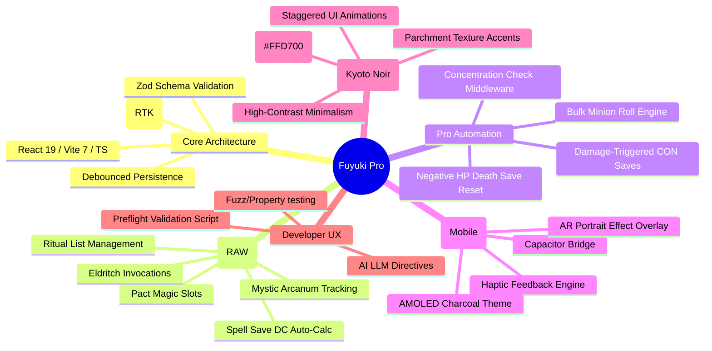
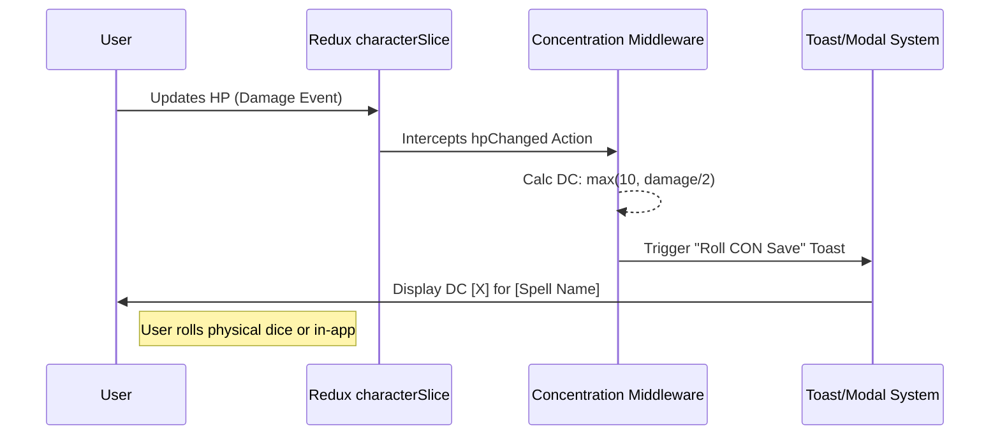

# Fuyuki Vision: The "Best of the Best" Ecosystem

This map visualizes the integration of every system discussed across our technical planning sessions.

## Data Flow: The Concentration Middleware

> [!TIP]
> **Best of the Best Policy**: We prioritize **Mechanical Speed**. Every tap counts. If an automation (like the Concentration DC) can save a user 5 seconds of math, it is a priority 1 feature.
