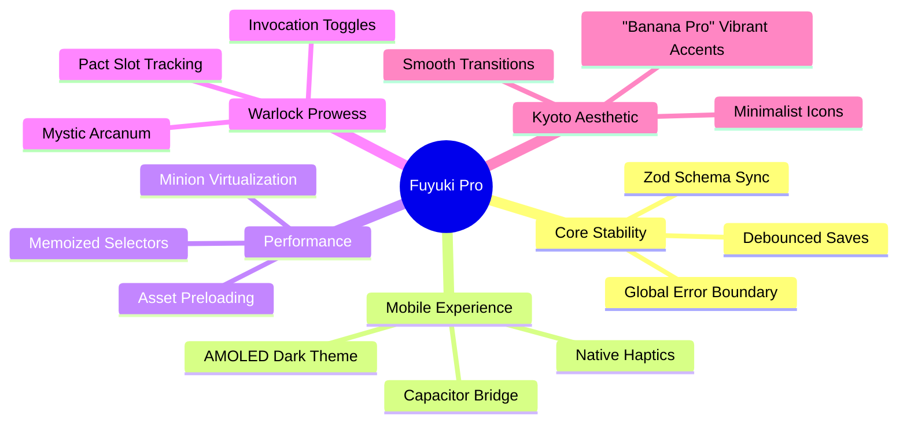
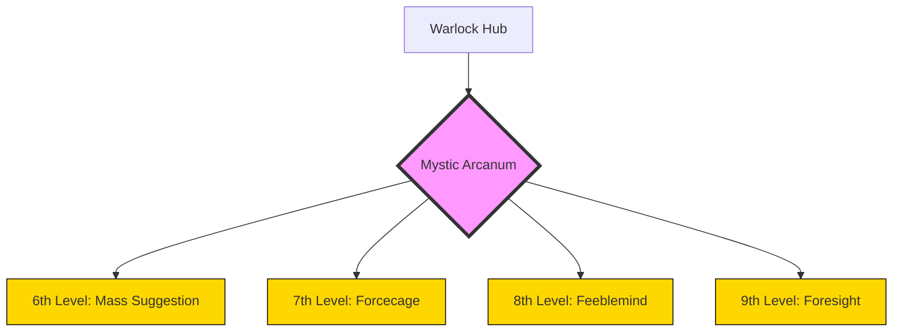

# Fuyuki Vision Mind Map: "Nano Banana Pro" Edition

This conceptual map visualize the "What's Next" for the Aramancia Tracker project.

## Conceptual Drawing: Mystic Arcanum Overlay

> [!NOTE]
> The "Banana Pro" aesthetic uses a **high-contrast charcoal and gold** palette. Gold (#FFD700) is used for active "Ritual" states and "Pro" features.

